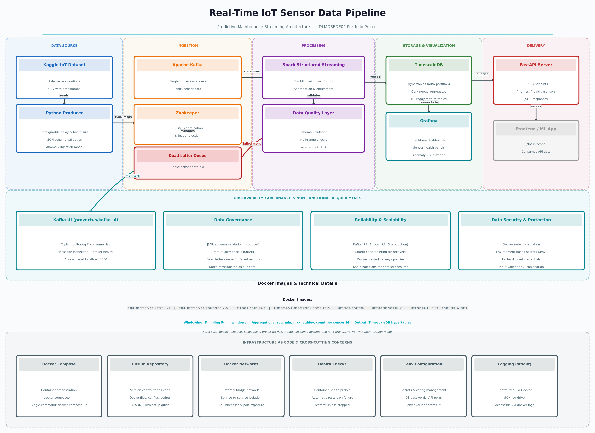

# Real-Time IoT Sensor Streaming Pipeline

A real-time streaming data backend for IoT predictive maintenance, built as a portfolio project for the **Data Engineering (DLMDSEDE02)** course at IU Internationale Hochschule.

## Overview

This system ingests, processes, and aggregates continuous IoT sensor readings in real-time. The architecture follows a microservices approach — all components run as isolated Docker containers orchestrated by a single `docker-compose.yml`.

**Use Case**: Predictive maintenance — monitoring industrial sensor data (temperature, humidity, pressure) to detect anomalies and predict equipment failures.

## Architecture



| Layer | Component | Technology | Purpose |
|-------|-----------|-----------|---------|
| Data Source | Producer | Python 3.11 | Reads Kaggle CSV, simulates real-time stream with configurable delay and 5% anomaly injection |
| Ingestion | Message Broker | **Apache Kafka 3.9.0 (KRaft)** | High-throughput streaming; dead letter queue for failed messages |
| Processing | Stream Processor | **Apache Spark 3.5.5** | 5-minute tumbling window aggregations per sensor (avg, min, max, stddev, count) |
| Storage | Time-Series DB | **TimescaleDB (PostgreSQL 15)** | Hypertables for raw readings and aggregates; continuous aggregate view |
| Visualization | Dashboards | Grafana | Auto-provisioned 5-panel dashboard |
| Delivery | REST API | FastAPI | `/health`, `/sensors`, `/metrics`, `/metrics/history` |
| Observability | Kafka Monitor | **Kafbat Kafka UI** | Topic inspection, consumer lag, live message browser |

### Key design decisions

| Decision | Choice | Reason |
|----------|--------|--------|
| Kafka coordination | KRaft mode — no Zookeeper | Zookeeper removed in Kafka 3.x; KRaft reduces the service count |
| Replication | RF=1, single broker | Local development; production would use 3 brokers with RF=3 |
| Schema validation | Python validator (no Schema Registry) | Simpler for a single-producer setup; producer and Spark both validate |
| Windowing output mode | `append` + 10-min watermark | Each `(sensor_id, window_start)` row emitted exactly once |
| Time-series storage | TimescaleDB over plain PostgreSQL | Native hypertable partitioning and Grafana datasource support |

## Prerequisites

- **Docker Desktop** v4.0+ with WSL2 backend (Windows) or Docker Engine (Linux/Mac)
- **8 GB RAM** allocated to Docker Desktop
- **Git**

## Quick Start

### 1. Clone the repository

```bash
git clone https://github.com/krishna8399/iot-streaming-pipeline.git
cd iot-streaming-pipeline
```

### 2. Download the dataset

Download the [IoT Temperature dataset](https://www.kaggle.com/datasets/atulanandjha/temperature-readings-iot-devices) from Kaggle and save it as:

```
data/IOT-temp.csv
```

### 3. Configure environment variables

```bash
cp .env.example .env
```

Set at minimum:

```env
POSTGRES_PASSWORD=choose_a_strong_password
GF_SECURITY_ADMIN_PASSWORD=choose_a_grafana_password
```

### 4. Start all services

```bash
docker compose up -d
```

First run pulls images and builds three custom containers — allow 5–10 minutes.

### 5. Verify services are up

```bash
docker compose ps
```

All 9 containers should show `Up` or `Up (healthy)` with no restarts.

### 6. Confirm data is flowing

After ~60 seconds:

```bash
curl http://localhost:8000/sensors
curl "http://localhost:8000/metrics?sensor_id=room_admin_in"
```

### 7. Open Grafana and set the time range

1. Go to **http://localhost:3000** and log in with `admin` / your Grafana password
2. Navigate to **Dashboards → IoT Sensor Pipeline**
3. Click the time picker and select **Absolute time range**
4. Set **From** `2018-12-01 00:00:00` **To** `2018-12-09 23:59:59` and click **Apply**

> The Kaggle dataset contains 2018 timestamps. Grafana defaults to "last 3 hours" which returns no rows — you must set the absolute range to match the dataset.

### 8. Other interfaces

| Interface | URL |
|-----------|-----|
| Grafana | http://localhost:3000 |
| Kafka UI | http://localhost:8080 |
| FastAPI Docs | http://localhost:8000/docs |
| Spark UI | http://localhost:4040 |

### Essential commands

```bash
docker compose up -d            # start everything
docker compose down             # stop, preserve volumes
docker compose down -v          # full teardown including data
docker compose logs -f producer # tail a service
docker compose up -d --build producer  # rebuild one service
```

---

## Services & Ports

| Container | Image | Host Port(s) | Purpose |
|-----------|-------|-------------|---------|
| `kafka` | `apache/kafka:3.9.0` | 9092, 29092 | KRaft broker |
| `spark-master` | `apache/spark:3.5.5` | 4040, 7077 | Spark standalone master |
| `spark-worker` | custom | — | Executor: 2 cores, 2 GB |
| `spark-streaming` | custom | — | Runs `streaming_job.py` |
| `timescaledb` | `timescale/timescaledb:latest-pg15` | 5432 | Time-series DB |
| `grafana` | `grafana/grafana:latest` | 3000 | Dashboards |
| `kafka-ui` | `ghcr.io/kafbat/kafka-ui:latest` | 8080 | Kafka inspector |
| `producer` | custom (python:3.11-slim) | — | CSV → Kafka |
| `api` | custom (python:3.11-slim) | 8000 | FastAPI REST server |

---

## Project Structure

```
iot-streaming-pipeline/
├── docker-compose.yml
├── .env.example
├── producer/
│   ├── Dockerfile
│   ├── producer.py
│   └── config.py
├── spark/
│   ├── Dockerfile
│   └── streaming_job.py
├── api/
│   ├── Dockerfile
│   ├── main.py
│   └── models.py
├── grafana/
│   └── provisioning/
│       ├── datasources/timescaledb.yml
│       └── dashboards/iot-sensor-dashboard.json
├── db/
│   └── init.sql
└── docs/
    └── architecture_diagram.png
```

---

## Data Flow

```
data/IOT-temp.csv  (loops continuously)
        │
        ▼
  [producer]  validates schema, injects 5% anomalies
        │
        ├─ invalid rows ──► sensor-data-dlq  (Kafka DLQ)
        │
        ▼
  [kafka]  topic: sensor-data  (3 partitions, 7-day retention)
        │
        ├──► [spark raw_query]    30s trigger → sensor_readings
        │
        └──► [spark agg_query]   5min trigger, 10min watermark
                  → sensor_aggregates
                        │
               ┌────────┴────────┐
           [Grafana]          [FastAPI]
```

---

## API Endpoints

| Method | Path | Description |
|--------|------|-------------|
| `GET` | `/health` | Liveness + DB connectivity check |
| `GET` | `/sensors` | All sensor IDs with reading counts |
| `GET` | `/metrics?sensor_id=X` | Latest completed 5-min window |
| `GET` | `/metrics/history?sensor_id=X&hours=N` | All windows within the last N hours |

The history endpoint looks back relative to the most recent window in the database, not wall-clock time — so it returns data correctly for historical datasets.

---

## Non-Functional Properties

- **Reliability**: DLQ captures every rejected message; Spark checkpoints allow restart from last offset; FastAPI retries DB connection on startup
- **Scalability**: 3 Kafka partitions support parallel consumers; hypertable chunks keep query scans bounded; continuous aggregate avoids scanning raw data for dashboards
- **Security**: all inter-service traffic on isolated `pipeline-net` bridge; credentials only via environment variables; Grafana datasource password in `secureJsonData`

---

## Technology References

- Kleppmann, M. (2017). *Designing Data-Intensive Applications*. O'Reilly.
- Narkhede, N., Shapira, G., & Palino, T. (2017). *Kafka: The Definitive Guide*. O'Reilly.
- Apache Kafka KRaft: https://kafka.apache.org/documentation/#kraft
- Spark Structured Streaming: https://spark.apache.org/docs/3.5.5/structured-streaming-programming-guide.html
- TimescaleDB: https://docs.timescale.com

---

## License

Submitted as an academic portfolio project for IU Internationale Hochschule (DLMDSEDE02). All rights reserved.
